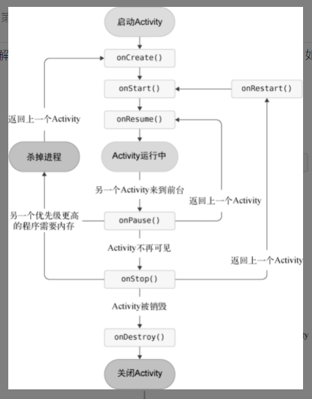

# C1 概述
Android系统架构：
* Linux内核层：提供硬件底层驱动
* 系统运行库层：一些C/C++库为提供特性资产，还有Android运行时库（Android Runtime），主要包括ART运行环境（5.0之前为Dalvik虚拟机）
* 应用框架层：提供构建应用程序时用到的各种API
* 应用层：所有安装在手机中的应用程序，包括系统应用

Android程序的设计讲究逻辑和视图分离，因此不推荐在Activity中直接编写界面，通常是在布局文件中编写界面，然后在Activity中将布局文件引入进来   
图片资源一般放在drawable-xxhdpi即可，这是主流的设备分辨率目录       
 
# C2 Kotlin基础
### 变量：
Kotlin通过一个特殊的编译器将代码转为class文件然后交由JVM虚拟机运行
Kotlin抛弃了基本数据类型，全部使用了对象数据类型
尽量将变量申明为val，val只是对象引用不可变，对象本身的改变并不限制
### 函数：
函数格式：`fun 函数名（参数列表）：返回值类型{函数体}`   
当函数体内只有一行代码时，可以将{}省略，然后用=将函数声明与函数体进行连接（同时可以省略返回值类型，返回值类型会被自动推导）   
### 逻辑控制：
if：与Java基本一样，只是增加了返回值的功能，条件分支的最后一行将会被作为返回值返回
when：类似switch，格式：when（参数）{ 匹配值 ->{执行逻辑} }，同样具有返回值的功能，也可以用来进行类型匹配，也可以不带参数，将判断的表达式完整地写在when的结构体中
### 循环：
while：与Java一样
for：for-i被抛弃，for-each被加强
* 关键字：..：闭区间，until：左闭右开，step：在循环内递增的增量，downTo，降序闭区间，
### OO
* 在class前加上open关键字，使类可以被继承    
* 继承方式:`class A:superclass()`
* 主构造函数：每个类默认存在一个不带参数的主构造函数，也可以指定参数，没有结构体，直接定义在类名的后面即可     
* 主构造函数的逻辑：写在init代码块里即可
* 子类的构造函数必须调用父类的构造函数，继承时父类名后的括号内没内容的话表明的就是调用父类的无参构造函数    
* 次构造函数：一般情况下通过给主构造函数设立默认值的方式可以避免使用次构造函数，次构造函数必须调用主构造函数，次构造函数使用`constructor`关键字来定义
* 接口：实现接口时不需要加（），而且允许接口内的函数有默认实现（JDK1.8后Java也支持），子类不实现默认实现的方法的话，该方法会使用默认逻辑
* 修饰符：抛弃default，加上了internal（同一模块中的类可见），默认使用的是public
* 数据类：data class，自动加上toString等方法
* 单例类：class关键字改为object即可，调用方式类似与Java静态方法的调用
### Lambda编程：
Lambda表达式结构：`{参数名1：参数类型，参数名2：参数类型 ->函数体}`,最后一行代码会自动作为表达式的返回值    
参数列表中只有一个参数时，可以不用声明参数名，直接使用`it`来代替
kotlin完全舍弃new关键字，因此创建匿名类实例的时候需要使用`object：`关键字  
### 空指针检查：
kotlin将空指针异常的检查提前到编译时期    
如果变量或参数可为空，则需在声明时在类名后加上可空声明符`?`    
判空辅助工具：
* `?.`：当对象不为空正常调用相应的方法，为空则什么都不做
* `?:`：左右两边都接收一个表达式，左边表达式结果不为空就返回左边的结果，否则返回右边的结果
### 函数参数
* 参数默认值尽量配合键值对传参的形式来使用    

#回调：回调函数的简称，指一段以参数形式传递给其他代码的可执行代码，该函数编写方是A，但是调用方是B，A调用了B的一个函数F1，调用时将回调函数F2作为参数传递给F1，然后B执行F1，执行完成后将结果传给F2，然后执行F2

 

# C3 Activity活动 && Intent意图
## Activity：
Activity的启动和组合方式是Android平台应用模型的基本组成部分，Android系统通过调用各Activity实例中对应各生命周期的回调方法来运行Activity实例中的代码    
Activity可以看作Android应用重新的最小单元，一个完整的应用程序通常包含多个Activity，其中有一个为主Activity，通常情况下是用户启动应用的第一个界面，但用户与应用的互动开始点可以是其他Activity，应用也可以调用其他应用的某一个Activity，而不是每次都从主Activity启动    

[生命周期]()：
* onCreate：Activity第一次被创建时调用，一般用来执行Activity的初始化操作
* onStart：Activity由不可见变为可见时调用
* onResume：准备好与用户进行交互时调用
* onPause：系统准备启动或恢复另一个Activity时调用
* onStop：Activity完全不可见时调用
* onDestroy：Activity被销毁前调用
* onRestart：Activity由停止状态变为运行状态前调用
* onSaveInstanceState：携带Bundle类型的参数，采用键值对的形式来保存数据，该方法会在Activity被回收前调用，而oncreate参数中的Bundle会带有回收前保存的数据       
Activity启动模式，清单文件内指定：
  * standard：默认模式，在栈顶入栈一个新的Activity实例，栈内是否已纯在
  * singleTop：栈顶如果是该Activity的实例，就直接使用，否则重新入栈新的实例
  * singleTask：栈内有已纯在的实例就直接使用并将上面的全部出栈，没有的话再新建实例
  * singleInstance：启用新的返回栈管理该Activity的实例，通常用于与其他程序共享的Activity，这样不同的程序在访问该Activity时，公用同一个返回栈

## Intent:
各组件间进行交互的一种载体
用来启动其他组件的方式通常有两种：
* 显示启动：代码里直接构造，指明意图
* 隐式启动：配合IntentFliter使用，各控件指明响应的意图信息（一个action，多个category，data用来指定响应的数据），代码中构造Intent时只指定信息，系统会通过构造的intent对象里包含的信息，寻找到与信息适配的控件，然后启动         

向其他控件传递数据：
* 使用一系列putExtra（）向下一个组件传递，数据使用键值对形式储存    
* 向上一个Avtivity返回数据：使用registerForActivityResult（API29后，之前使用startActivityForResult，29后弃用）    
  
   

## C3 kotlin：
### 标准函数：
* `let`：在对象上调用，将调用对象本身传递进lambda表达式中
* `with`：接收两个参数，第一个为任意类型的对象，第二个为Lambda表达式，该函数会在Lambda表达式中提供第一个参数的上下文，并使用Lambda表达式的最后一行代码作为返回值，常用于连续调用同一对象的多个方法
* `run`：接收一个Lambda参数，在某个对象上调用，在Lambda表达式中提供调用对象的上下文，同样使用最后一行作为返回值返回
* `apply`：接收调用同上，只是返回对象本身，适用于在一段代码内需要对某一对象多次处理的情况
### 静态方法：
使用上，工具类直接使用单例类来干，其他情况下将函数放入`companion object{}`内，实现类似与Java的形式       
也可以使用顶层方法的形式，对于顶层方法：kotlin内直接调用，Java中静态方法形式       

 

# C4 UI与控件
适配相关：
* px：像素，屏幕上的实际像素点，每个px对应屏幕上的一个点
* dp：也叫dip，设备独立像素，一种基于屏幕密度的抽象单位，在每英寸160像素点的显示器上，1dp=1px，随着屏幕密度的改变，dp与px的换算也会发生改变
* sp：主要用来处理字体的大小,可以根据用户的字体大小首选项进行缩放，即当控件文字大小指定为sp时，当系统文字大小进行更改后，控件文字大小也会随之改变
换算关系：
  px与dp换算：
  px = dp*（density/160），density为屏幕密度，density=dpi/160，dpi（像素密度），表示每英寸距离中有多少个像素点
常用控件：
* TextView：用来在界面上显示一段文本信息
* Button:通过设立监听器，实现点击事件的一个控件，可以看作是带点击功能的TextView
* EditText：允许用户在控件里输入和编辑内容，并可以在程序里对这些内容进行处理
* ImageView：用于在界面上展示图片的一个控件
* ProgressBar：在界面上展示一个进度条
* AlterDialog：在当前界面弹出一个对话框，该对话框置顶于所有界面元素之上，可以屏蔽其他控件的交互能力     
* ListView（推荐使用RecyclerView）：提供一个列表来展示大量数据，比如音乐播放器的歌曲列表，可以通过自定义子项来实现复杂的界面
* RecyclerView：一个用来显示大量数据的控件，开发者提供数据并定义每个列表项的外观，库会根据需要动态创建元素，当列表项滚出屏幕时，库不会销毁其视图，库会对屏幕上滚动的新列表项重用该视图，由此可以提升性能，改善应用响应能力并降低功耗       
##### RecyclerView的使用：
[示例程序](https://github.com/android/views-widgets-samples/tree/main/RecyclerViewKotlin/)
关键类：
* RecyclerView：控件，包含与数据视图对应的ViewGroup
* ViewHolder：列表中每个独立元素都由ViewHolder对象进行定义，创建ViewHolder时，没有关联任何数据，当创建后，RecyclerView会将其绑定到对应的数据，通常使用RecyclerView.ViewHolder来定义
* Adapter： RecyclerView会请求视图，然后在Adapter中调用方法，将视图绑定到数据上，通常使用RecyclerView.Adapter来定义
* 布局管理器负责排列列表中的各个元素，可以使用自带，也可以自定义自己的布局管理器，布局管理器均继承于LayouyManager抽象类       

实现步骤：
* 1 首先确定列表或网格的外观
* 2 设计列表中每个元素的外观和行为，根据该设计，扩展ViewHolder
* 3 定义用于将数据与Viewholder相关联的Adapter

常用布局：
* LinearLayout：线性布局，将包含的控件在线性方向上依次排列
* RelativeLayout：相对布局，通过相对定位的方式让控件出现在布局的任何位置
* FrameLayout：帧布局，所有控件默认摆放在布局左上角，
* ConstraintsLayout：约束布局，通过给控件添加约束条件来确定位置        

## C4 kotlin：
延迟初始化：通常在全局变量上使用，使用`lateinit`关键字，表明该变量的初始化会在稍后进行，这样在其他地方使用时就不需要再进行判空处理，但是一定要确保在使用前进行初始话，否则会抛出异常
密封类：一种受限的类继承结构，该类只能有几种子类去继承它，密封类与其所有子类只能定义在同一文件的顶层位置，可以配合when使用，当when条件传入一个密封类变量为条件时，编译器会强制将该类的全部子类进行处理，否则编译不通过

 

# C5 [Fragment碎片](https://developer.android.google.cn/guide/fragments?hl=zh-cn) 
碎片,表示应用界面中可重复使用的一部分，可以定义和管理自己的布局，拥有自己的生命周期，也可以处理自己的输入事件，Fragment不能独立存在，必须由Activity或另一个Fragment托管，Fragment的视图层次结构会成为宿主的视图层次结构的一部分，或附加到宿主的视图层次结构       
## C5 kotlin：扩展函数与运算符重载
扩展函数：在不修改某个类源码的情况下，向该类添加新的函数，最好定义为顶层方法，以便函数拥有全局的访问域
语法：`fun 类名.方法名(参数1:类型,参数2:类型)：返回值{函数体}`
运算符重载：在指定函数（运算符对应的函数）的前面添加`operator`关键字,然后编写逻辑       

  

# C6 广播与广播接收器
广播：借助Intent实现发送        
* 标准广播：异步，不可被截断
* 有序广播：同步，可被截断
接收器注册：给接收器注册感兴趣的广播，当收到时在接收器内部进行逻辑处理       
* 静态注册：在清单文件内注册，隐式广播（未指明发送给哪个程序的广播）不允许通过该方式来注册，使用方式需要再清单文件内添加IntentFilter
* 动态注册：在代码中注册，通过构造包含广播action的intentFilter，然后通过registerReceiver注册接收器，实现动态注册，动态注册的接收器必须取消注册
涉及到权限：一些敏感的权限必须在清单文件内进行声明，6.0及以上还需进行运行时权限检查       
需要注意的是：接收器内是不允许开启线程的，当接收器的onReceive内执行了耗时操作时，会导致ANR的出现
发送广播：
* 无序：使用Intent来发送，首先构建Intent对象，然后传入广播，接着需要调用`setPackageName`方法来指定广播是发送给哪个应用程序，避免该广播成为隐式广播，然后调用sendBroadcast   
* 有序：构造方式同上，发送使用sendOrderdBroadcast，在接收器注册时指定优先级，如果要截断，在onreceive内进行截断（调用abortBroadcast）

## C6 高阶函数
高阶函数定义：一个接收函数作为参数或返回值是另一个函数的函数       
在Kotlin中，函数有其专门的类型——函数类型，函数类型的语法基本规则为：`(参数1类型，参数2类型...) -> 返回值类型`
Lambda表达式是最常见也是最普遍的高阶函数调用方式       
函数类型的前面加上`类名.`，表示该函数类型是定义在哪个类中的   
Lambda表达式在底层被转换成了匿名类的实现方式，这就表明每调用一次Lambda表达式，都会产生一个新的匿名类实例，会造成额外的开销，为了解决这个问题，在定义高阶函数时使用内联函数的形式
语法：在fun关键字前加上`inline`关键字即可，如果只想内联参数中其中的一个，那么在参数名前加上`noinline`即可，表明该表达式不需要内联
内联的函数类型参数只允许传递给另一个内联函数    
尽量将高阶函数声明为内联函数
crossinline？？？      

# C7 数据持久化相关
数据持久化：将内存中的瞬时数据保存到存储设备中，保证数据不会丢失       
持久化技术：一种让数据在瞬时状态和持久状态间进行转换的机制       
Android持久化主要是三种方式实现：文件存储、SharedPreferences和数据库存储

---
文件存储：最基本的方式，不对内容进行处理，所有数据都是原封不动的保存到文件中
存储：       
使用Context类中的openFileOutput（）方法，该方法接收两个参数，第一个为文件名，不能包括路径，因为所有的文件都默认存储到`/data/data/<package name>/files/`下，第二个为文件的操作模式
，一个是覆盖式写入，另一个是追加式写入，该方法返回的是一个FileOutputStream对象，得到该对象后以Java流形式写入
       
读取：
使用openFileOutput（），只接收一个参数，即要读取的文件名，系统会自动到`/data/data/<package name>/files/`目录下加载该文件，并返回一个FileInputStream对象，得到该对象后以Java流形式读取数据       
___

SharedPreferences存储：使用键值对的形式来存储数据       
获得SharedPreferences对象：
* Context类中的`getSharedPreferences()`方法：该方法接收两个参数，第一个用于指定SharedPreferences文件的名称，如果不存在则会创建一个，SharedPreferences文件都是存放在
  `data/data/<package name>/shared_prefs`目录下，第二个参数用来指定操作模式，目前只能指定MODE_PRIVATE一种，表示只有当前的应用程序才可对该文件进行读写       
* Activity类中的`getPreferences()`方法：该方法只接收一个参数来指定操作模式，该方法会自动将当前Activity的类名作为SharedPreferences文件的文件名       
得到对象后存储数据：    
* 调用SharedPreferences对象的edit方法获取一个SharedPreferences.Editor对象
* 向Edit对象中添加数据
* 调用apply方法将添加的数据提交，完成数据存储操作
读取SharedPreference内的数据：        
取得SharedPreference对象，用各get方法取出数据     
   
___

SQLite数据库存储
SQLite:一款轻量级的关系型数据库，支持标准的SQL语法，还遵循了数据库的ACID事务，该数据库内嵌于Android系统中       
SQLite的作用与目的：缓存应用所需要的数据，同文件直接存储和SharedPreference一样，都是作应用的一个数据仓库，只不过SQLite是使用数据库来管理数据
创建数据库：    
Android提供了一个SQLiteOpenHelper帮助类来管理数据库，该类为抽象类，使用时需自定义类继承实现该类，必须重写onCreate和onUpgrade
两方法，在这两个方法中实现创建和升级数据库的逻辑，
该类还有两个实例方法getReadableDatabase和getWritableDatabase，这两方法都可以创建或打开一个现有的数据库（存在就打开，不存在就创建一个新的）并返回一个可对数据库进行读写操作
的对象，区别在于当数据库不可写入的时候（如磁盘空间已满），getReadableDatabase返回的对象将以只读形式打开数据库，另一个会出现异常       
SQLiteOpenHelper中有两个构造方法可以重写，一般重写参数少的那个，该方法接收4个参数
* 1. Context：
* 2. 数据库名：创建数据库时使用该名称
* 3. 查询数据时返回一个自定义的Cursor：一般传入null
* 4. 表示当前数据库版本号，一般用来对数据库执行升级操作       
构造出SQLiteOpenHelper实例后，再调用该实例的getReadableDatabase或getWritableDatabase方法就可以创建数据库了，数据库文件会存放在`/data/data/<package name>/database/`
     目录下，此时，重写的onCreate方法也会得到执行，通常在这里执行一些建表的逻辑       
SQLite内的数据类型：
* integer：整型
* real：浮点
* text：文本
* blob：二进制              

添加数据：       
CRUD:对应4种操作：CREATE,RETRIEVE,UPDATE,DELETE
操作:
1. 借助Helper内返回的SQLiteDatabase对象       
* 添加数据：SQLiteDatabase中的insert()方法，该方法接收3个参数，第一个是表名，第二个参数用来在未指定添加数据的情况下给某些可为空的列自动赋值NULL，第三个为为
一个ContentValues对象，它提供了一系列put方法重载，用来向ContentValues中添加数据，只需要将表中的每个列名以及相应的待添加数据传入即可       
* 更新数据：update（）方法，该方法接收4个参数，第一个为表名，第二个为ContentValues，第三，第四用于约束更新某一行或某几行的数据，不指定的话默认更新所有行      
* 删除数据：delete（）方法，该方法接收3个参数，第一个为表名，第二第三用于约束删除某一行或某几行的数据，不指定默认删除所有行
* 查询数据：query（）方法，该方法最少接收7个参数，第一个为表名，第二个用来指定查询哪几列，不指定默认查询所有列，第三第四用于约束查询某一行或某几行的数据，不指定默认查询所有行，
第五个用于指定需要去group by的列，不指定则不对查询结果进行group by操作，第六个用于对group by之后的数据进行进一步过滤，不指定则不过滤，第七个用于指定查询结果的排列方式，不指定则使用默认排序方
  式，该方法返回一个Cursor对象，查询到的所有数据都将从这个对象中取出
  
2. 使用SQL来进行操作：
* 查询数据使用SQLiteDatabase对象的rawQuery（）方法
* 其他操作使用execSQL（）方法       

___

## C7 高阶函数应用

___

# C8 ContentProvider内容提供器:(一般用来配合程序的SQLite数据库)
## ContentProvider:
第七章中的三种方式所保存的数据只能供本程序访问使用，如果需要进行跨程序数据共享，Android提供了ContentProvider来实现不同程序间的数据共享       
ContentProvider：该组件的作用是提供一种机制在不同的应用程序间实现数据共享的同时保证被访问数据的安全性，目前该方式是Android实现跨程序共享数据的标准方式，该组件可以选择只共享一部分数据，保证了隐私数据的安全性     

### 运行时权限：
6.0中引入，使用户不需要在安装时一次性授予所有申请的权限，而是可以在软件运行过程中对某一项权限申请进行授权，即使拒绝，不会影响需要该权限功能外的其他功能的使用，Android中权限大致分为两类       
* 普通权限：不会直接威胁用户安全和隐私的权限，该类权限申请系统会自动授权，不需要用户手动授权
* 危险权限：可能触及到用户隐私或对设备安全性造成影响的权限，该类权限必须由用户手动授予，否则无法使用相应功能，共11组30个权限              

在进行运行时权限处理时使用的是权限名，原则上，用户同意了某个权限申请后，同组的其他权限也会被系统自动授权       
运行时权限检查的步骤：(在Activity中进行)
* 检查是否已经授权：使用ContextCompat.checkSelfPermission()方法，该方法接收两个参数，第一个为context，第二个为具体的权限名，判断该函数的返回值是否为PackageManager.PERMISSION_GRANTED，是的话说明已经授权，否则没有授权
* 进行下一步：1.已授权：执行逻辑 2.没授权：调用ActivityCompat.requestPermissions()方法向用户申请权限，该方法接收三个参数，第一个为Activity的实例，第二个为一个String数组，包含要申请的权限名，第三个为请求码，确保唯一即可
* 当调用完ActivityCompat.requestPermissions()方法后，系统会回调到onRequestPermissionsResult()方法中，授权结果会封装在grantResults参数中，开发者需重写该方法，根据授权结果进行下一步处理

### ContentProvider:
该组件的使用方式一般有两种：
* 1. 使用现有的ContentProvider读取和操作相应程序中的数据
* 2. 创建自己的ContentProvider，给程序的数据提供外部访问接口      
  
#### 使用现有的ContentProvider：
如果一个应用程序通过ContentProvider对其数据提供了外部访问接口，那么任何其他的应用程序都可以对该部分数据进行访问，系统自带的通讯录、短信等程序都提供了类似的访问接口，程序想访问ContentProvider中共享的数据，需借助ContentResolver类来实现,
可以通过Context中的getContentResolver（）方法取得该类的实例，该类中提供了一系列的方法用来对数据进行增删改查，insert、update、delete、query，这几个方法接收的都是一个Uri参数
       
Uri：内容RRI，该参数为ContentProvider中的数据建立了唯一标识符，主要由两部分组成：authority和path，authority用来区分不同的应用程序，一般使用应用包名，path则是对同一程序中不同的表做区分的，通常加在authority的后面    
标准格式：content://com.example.app.provider/table       

思路：       
* 访问其他程序提供数据：获得该程序提供的内容URI，然后借助ContentResolver进行增删改查即可

#### 创建自己的ContentProvider：

  
  
## C8 Kt 泛型和委托:

# C11
### Android网络交互方式：
* HTTP连接：请求-响应模式，客户端向后端发起请求，后端解析请求，然后返回数据，客户端解析返回的数据
* socket连接：长连接模式，相当于在客户端和服务器端建立一条双向通道，
### 网络请求方式
* 使用HttpURLConnection：原生方式
* 使用OkHttp：第三方
### 数据媒介：
* xml：常用解析方式：1.pull解析 2.SAX解析 3.DOM解析
* JSON：常用解析方式：1.JSONObject，原生 2.借用GSON来进行解析
### Retrofit与回调机制
* Retrofit：最常用的网络库，基于OkHttp
* 回调机制：因为网络请求属于耗时操作（虽然一般用不了多长时间），如果在UI线程内执行网络操作，容易引发ANR，所以借用回调机制来规避
### Kotlin协程
* 可以看作轻量级线程
* 协程间的切换可以在编程语言层面上进行，而线程的切换通常需要在系统调度下进行

  